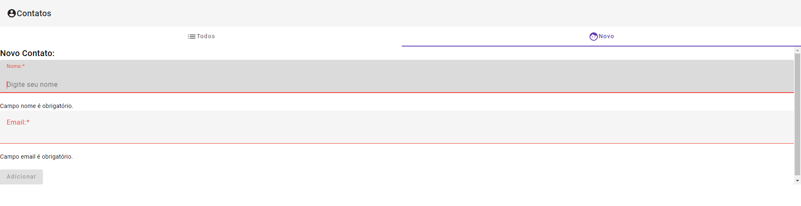
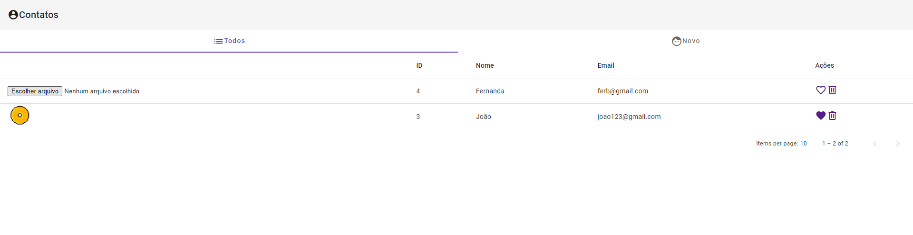
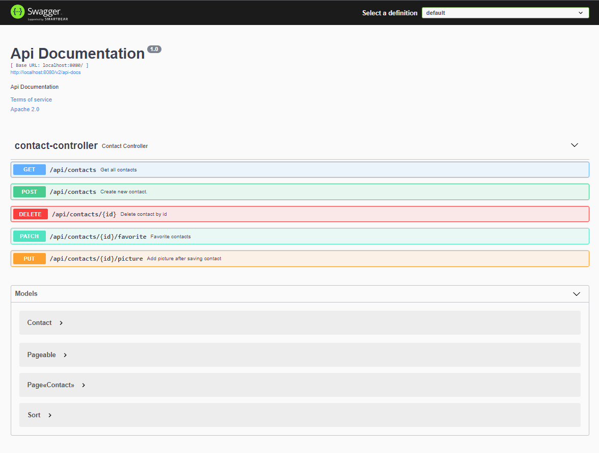

# Agenda

Projeto feito acompanhando o curso da Udemy "Angular 9 + Spring Boot 2.2: Fullstack Completo e Atualizado", no qual é feito uma agenda, em que se pode criar um novo contato com nome e email, adicionar foto, visualizar, excluir, e favoritar contatos.

### Tecnologias Utilizadas:

- Java
- Spring Boot
- Angular
- TypeScript
- HTML
- CSS
- PostgreSQL

### Telas do sistema

- Tela de Criação de Contatos

- Tela de Visualização de Contatos
 

### Documentação Swagger:

